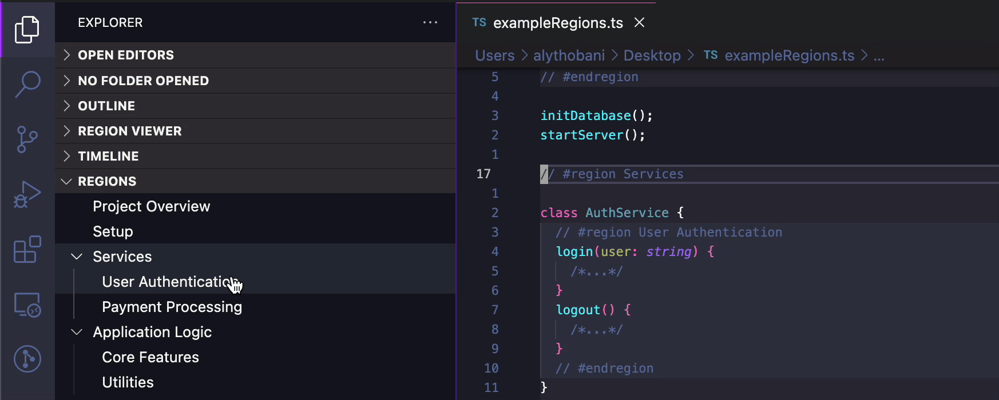
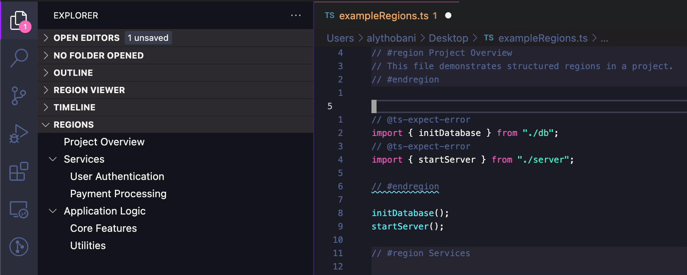
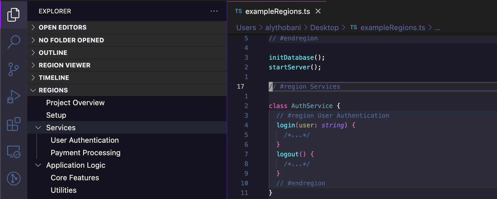
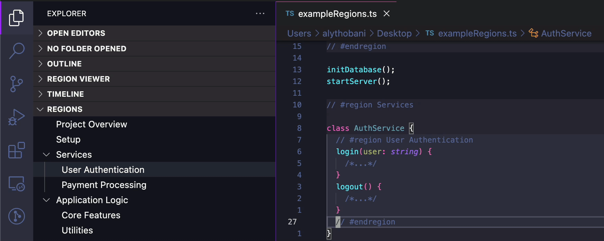
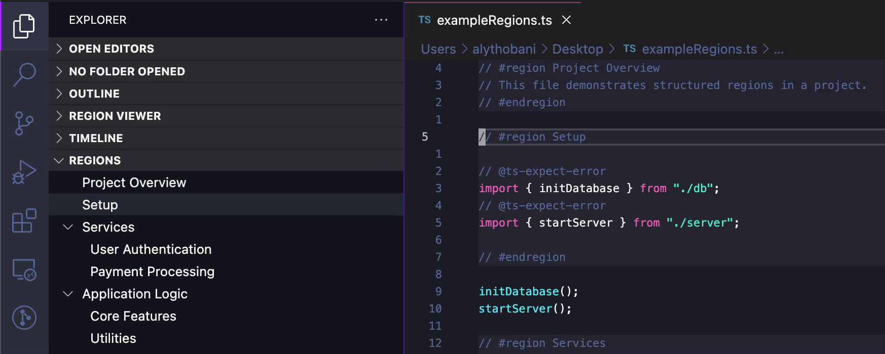
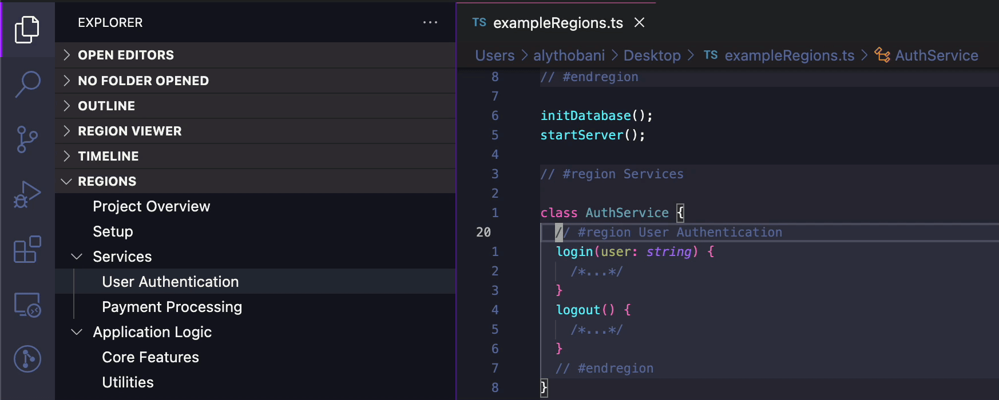

# Region Helper

A [Visual Studio Code](https://marketplace.visualstudio.com/items?itemName=AlyThobani.region-helper) **Visual Studio Code** extension for **navigating, visualizing, and managing code regions** in your files.  

Provides an **interactive tree view**, **diagnostics for unmatched region boundaries**, and **convenient commands** for jumping, searching, and selecting regions.

## Features

### 📂 Region Tree View

- Displays a **structured tree view** of all regions in the active file.
- **Automatically highlights** the cursor’s active region.
- Click a region to **instantly navigate** to it.

### ⚠️ Region Diagnostics

- Detects **unmatched region boundaries** (start or end) and **adds warnings** in both the editor and the Problems panel.
- Helps you **catch incomplete or misplaced** regions quickly.

### 🔍 Go to Region (Fuzzy Search)

- Opens a **fuzzy-searchable dropdown** to jump to any region in the active file.
- 📌 **Default Keybinding**:
  - **Windows/Linux**: `Ctrl + Shift + R`
  - **Mac**: `Cmd + Shift + R`

### 🐇 Go to Region Boundary

- Like VSCode’s built-in **"Go to Bracket"**, but for regions.
- Jumps between **matching region start and end boundaries**.
- Jumps to the **next region** if the cursor is not already inside a region.
- 📌 **Default Keybinding**: `Alt + M`

### ⏭️ Go to Next / Previous Region

- Jumps to the **next or previous region** in the file.
- 📌 **Default Keybindings**:
  - **Next Region**: `Ctrl + Alt + N`
  - **Previous Region**: `Ctrl + Alt + P`

### 🎯 Select Current Region

- Selects the **entire region** the cursor is currently inside.
- 📌 **Default Keybinding**: `Alt + Shift + M`

### ⚙️ Custom Region Patterns

- **Supports nearly 50 languages** out of the box, including:
  - **C, C++, C#, Java, Python, JavaScript, JSX, TypeScript, TSX, PHP, Ruby, Swift, Go, Rust, HTML, XML, Markdown, YAML, SQL, and more**.
- Define **custom region patterns** in settings to **extend or override defaults**.

## 🚀 Installation

1. **[Install Region Helper](https://marketplace.visualstudio.com/items?itemName=AlyThobani.region-helper)** from the VSCode Marketplace.
2. ???
3. **Profit!**

## 🚧 Known Limitations

- **Go to Region**'s dropdown is not fully fuzzy-searchable; it only supports camelCase matching. This is due to a [limitation in VSCode's API](https://github.com/microsoft/vscode/issues/34088#issuecomment-328734452).
- **Region Tree View** may still highlight the last active region when the cursor is outside of any region. This is another [limitation of VSCode's API](https://github.com/microsoft/vscode/issues/48754).

## ❤️ Contributing & Feedback

I may have limited availability, but **bug reports, suggestions, and contributions** are always welcome! Feel free to:

- **[File an issue](https://github.com/alythobani/vscode-region-helper/issues/new/choose)** for bugs or feature requests.
- **[Browse issues open to PRs](https://github.com/alythobani/vscode-region-helper/issues?q=state%3Aopen%20label%3A%22accepting%20PRs%22)** and submit one if you'd like to help.
- **[Leave a review](https://marketplace.visualstudio.com/items?itemName=alythobani.region-helper&ssr=false#review-details)** to share your thoughts. Be honest, but please be kind too! I'm just one person trying to make a useful tool for myself and others. 😸

---

Hope you enjoy using **Region Helper**. Have a great day, and try to make someone else's day great too! 😊
